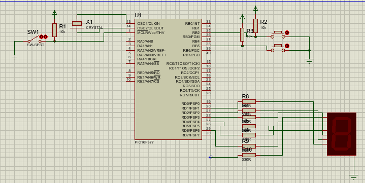

# DisplaySeteSegmento
O cricuito é composto basicamente por um display de 7 segmentos e duas tecla, além do pic16f877.
O display apresentará ao operador do sistema o valor de uma variável que será alterada pelas
duas teclas. Estas teclas serão nossos dispositivos de entrada.

